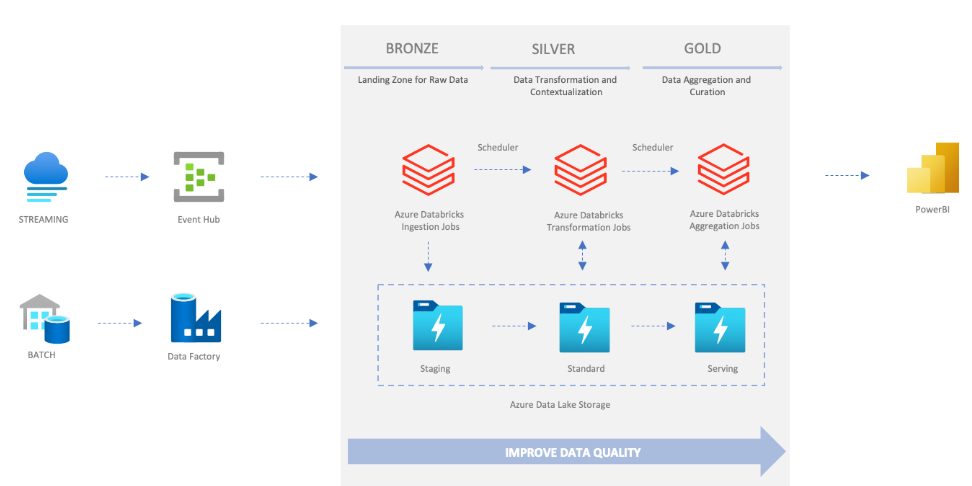

### **Aligned Project: Project 4 - Retail Inventory Management System – Azure Data Pipeline**  

---

### **Goal of the Project:**  
Develop an end-to-end data pipeline to process and manage retail inventory data, including stock levels, sales transactions, and supplier information. The solution ensures data quality and enables analytics for inventory forecasting and optimization.  

---

### **Flow of the Project:**  

1. **Data Sources:**  
   - **Streaming Data (Event Hub):** Real-time updates, such as stock changes and sales transactions.  
   - **Batch Data (Data Factory):** Periodic uploads of product catalogs, supplier data, and historical sales records.  

2. **Data Storage (Bronze Layer - Staging):**  
   - Raw data from streaming and batch sources is stored in **Azure Data Lake Storage (Bronze)** as a landing zone for raw, unprocessed data.  

3. **Data Processing (Silver Layer - Standard):**  
   - **Transformation Jobs in Azure Databricks:**  
     - Cleanses and standardizes data.  
     - Applies transformations to validate stock levels and sales records.  
     - Contextualizes data by adding metadata (e.g., timestamps, supplier details).  

4. **Data Aggregation (Gold Layer - Serving):**  
   - **Aggregation Jobs in Azure Databricks:**  
     - Aggregates data for reporting, such as total sales, inventory turnover, and low-stock alerts.  
     - Prepares data for analytics and machine learning models.  

5. **Data Visualization (Power BI):**  
   - Connects to the **Gold Layer** to generate reports and dashboards for inventory trends, supplier performance, and demand forecasting.  

---

### **Services Used:**  

1. **Azure Event Hub:** Captures real-time updates on stock levels and sales.  
2. **Azure Data Factory:** Loads batch data like supplier details and historical sales.  
3. **Azure Databricks:** Processes and transforms data across **Bronze**, **Silver**, and **Gold** layers.  
4. **Azure Data Lake Storage:** Stores raw, processed, and aggregated data in separate containers.  
5. **Power BI:** Visualizes data for inventory insights and reporting.  

